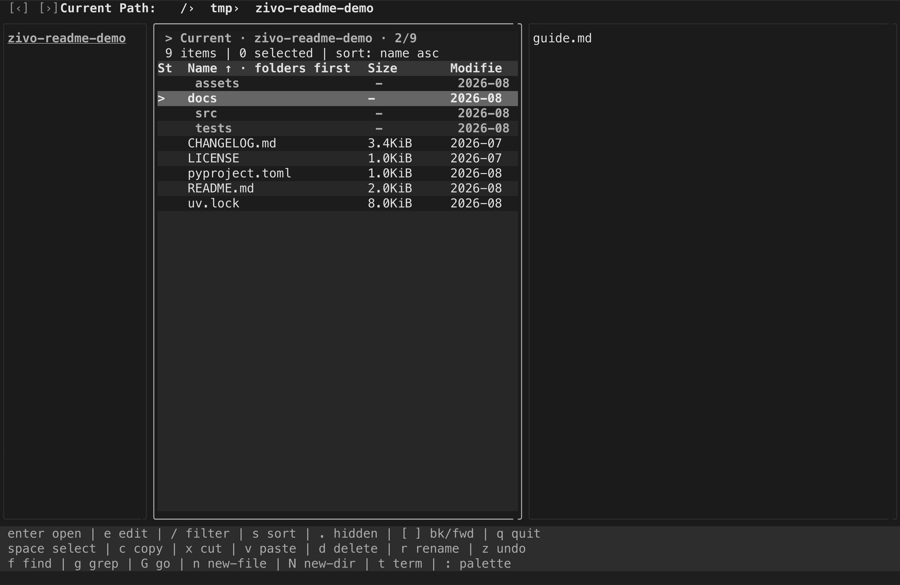
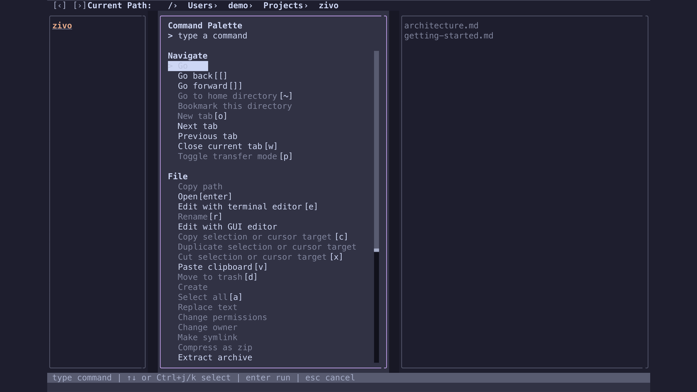
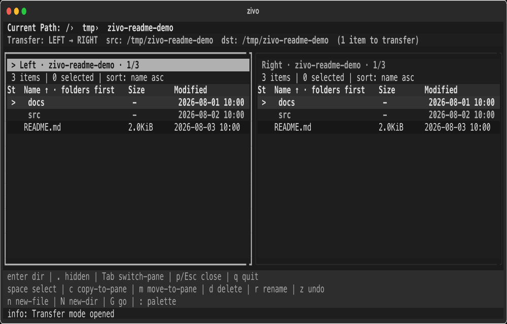

# zivo


---
[English](README.md) | [日本語](README.ja.md)
---

zivo is a TUI file manager designed to be usable without memorizing dozens of shortcuts.

By default, it keeps actions relevant to the current state visible in the help bar, and lets you run everything else from the command palette. You can browse, preview, search, grep, replace, and transfer files without leaving the terminal.

---

## Who zivo is for

- People who want a terminal file manager without memorizing many shortcuts
- People who want to browse, preview, search, grep, and replace files from the terminal
- People who find ranger, lf, nnn, or yazi powerful but somewhat expert-oriented
- People who work mainly in terminals or WSL and want to avoid switching to a GUI file manager

---

## Highlights

- **No memorization required**: relevant standard shortcuts are shown in the help bar
- **Context-aware command palette**: press `:` to browse fixed Navigate, File, Search, View, System, and Custom actions sections
- **Three-pane preview**: preview directories, text, images, PDF, and Office files
- **Transfer mode**: copy and move files between two directories side by side
- **Search and grep**: find files, grep recursively, and open files from results
- **Replace with preview**: choose a scope, review diffs, then apply a batch replacement

---

Browse directories across three panes while previewing files on the right. Use file search and grep to quickly jump to any file. The help bar follows the current state and standard keybindings, so you never feel lost.



Press `:` to search and run any action from the command palette. The palette supports incremental search, letting you find and execute commands quickly without memorizing keybindings.



Transfer mode puts two directories side by side for easy copy and move operations.
Press `y` to copy or `m` to move files to the opposite pane, and verify results immediately.


---

## Installation

### Minimal installation

```bash
uv tool install zivo
```

### Recommended tools

Some features use external commands.

| Feature | Tool |
| --- | --- |
| Image preview | `chafa` |
| PDF preview | `pdftotext` / `poppler` |
| Office preview | `pandoc` |
| Grep search | `ripgrep` |

See [Platforms](docs/platforms.md) for OS-specific setup instructions.

---

## Run

```bash
zivo
```

`zivo` itself cannot change the current directory of the parent shell. If you want your shell to follow the last directory you visited after quitting zivo, add shell integration first:

```bash
eval "$(zivo init bash)"  # for bash
eval "$(zivo init zsh)"   # for zsh
```

This defines a shell function named `zivo-cd`. Start zivo with `zivo-cd` when you want the parent shell to `cd` into the last directory on exit:

```bash
zivo-cd
```

**Note**: Shell integration (`zivo-cd`) is currently not supported on Windows. Use plain `zivo` on Windows.

---

## Basic controls

By default, actions relevant to the current state are shown in the help bar.
You can also press `:` to open the command palette and search for available actions.

| Key | Action |
|---|---|
| `↑` / `↓` or `j` / `k` | Move cursor |
| `Enter` | Open file / enter directory |
| `←` / `h` | Go to parent directory |
| `Space` | Toggle selection |
| `:` | Open command palette |
| `/` | Filter entries |
| `f` | Find files |
| `g` | Grep search |
| `p` | Toggle Transfer mode |
| `q` | Quit |

See [Keybindings](docs/keybindings.md) for the full list.

---

## Command palette

Press `:` to search and run available actions. With an empty query, the palette shows fixed Navigate, File, Search, View, System, and Custom actions sections. The full list is scrollable with the mouse wheel; `↑` / `↓` and `Ctrl+j` / `Ctrl+k` keep the selected row visible.

Search accepts common aliases and keywords such as `duplicate` for Copy, `trash` for Move to trash, `grep` or `search contents` for Grep search, and `shell` for opening a terminal. Results are ranked deterministically. Commands that do not apply remain searchable but are dimmed with a concrete reason; pressing Enter on one shows the same reason as a warning. Registered custom actions are always listed, while actions that do not satisfy their configured context conditions are disabled with a reason; they are also searchable by name.

See [Commands](docs/commands.md) for the full command list.

---

## Features

### Browsing
- **Three-pane layout**: directory tree on the left, file list in the center, preview on the right
- **Tabs**: open multiple directories and switch between them
- **Directory history**: go back / forward through visited directories
- **Bookmarks**: save directories and open them from the bookmark-filtered Go view with `b`
- **Go**: search bookmarks, recent history, open tabs, Home, or a direct path in one view; use `@bookmark`, `@history`, `@tab`, or `@home` prefixes to filter the source

### File operations
- **Copy / Cut / Paste**: within a pane or across panes in Transfer mode
- **Rename**: inline rename
- **Permissions and ownership**: change selected targets' octal mode or owner/group from the command palette on POSIX-style filesystems
- **Delete**: move to trash (`d`) or permanently delete (`D`); permanent delete shows target count, total size, representative names, and an irreversible-operation warning
- **Undo**: revert rename, paste, or trash operations
- **Multi-selection**: select files with Space, or Select all

### Archives
- **Compress**: zip selected items
- **Extract**: extract zip / tar / tar.gz / tar.bz2

### Search and replace
- **Find files**: recursive filename search
- **Grep search**: recursive content search via ripgrep with directory, current-file, selected-files, or Search Workspace scopes and common filename / extension filters
- **Replace**: one scope-aware flow for current file, selected files, directories, found files, and grep result files

### Preview
- Text, images (chafa; optional Kitty graphics protocol on compatible terminals), PDF (pdftotext), Office (pandoc)

### Transfer mode
- Side-by-side two-pane layout for copying or moving files between directories

### Command palette
- Press `:` to search and execute any action via incremental search. No need to memorize keybindings
- Lower-frequency attribute, path-copy, bookmark-edit, external-launch, and reload actions live in the palette; Go combines destination search while `~`, `[`, `]`, and `b` remain quick paths

### Customization
- **Settings overlay**: interactively edit and save startup configuration
- **Custom actions**: add external tools to the command palette
- **config.toml**: use the Config Editor for common themes, sorting, previews, editors, and delete confirmation; edit advanced settings in the raw file

### External integration
- **Open and edit**: open a selected file with its OS default app, or edit it with a terminal or GUI editor
- **Foreground shell**: suspend zivo for interactive work in the current terminal
- **Terminal**: open the current directory with an external terminal window for independent work
- **Run command**: run a short non-interactive command in the current directory, with retained exit/output/error details
- **File manager**: open the current directory with the OS file manager
- **Clipboard**: copy paths to the system clipboard

---

## Configuration

zivo automatically creates `config.toml` on first launch.
The Config Editor covers commonly changed themes, previews, sorting, editor integration, and delete confirmation. Press `e` there to edit advanced settings in `config.toml`; saving from the UI preserves advanced and unknown settings.
You can also add custom command palette actions for external tools.
Help text itself is generated from the current state and standard keybindings.

See [Configuration](docs/configuration.md) for details.
See [Custom Actions](docs/custom-actions.md) for custom action examples and safety notes.

---

## Safety

zivo includes safety mechanisms to prevent data loss during file operations.

- **Move to trash**: `d` / `Delete` moves items to the OS trash (confirmation dialog configurable)
- **Permanent delete**: `D` / `Shift+Delete` always asks for confirmation; multiple targets or directories require `Enter` followed by an explicit uppercase `D`
- **Undo**: `z` reverses the last rename, paste, or trash operation
- **Paste conflict resolution**: choose overwrite, skip, or rename on name collision
- **Replace preview**: review diffs before applying batch replacements
- **More details**: see [Safety](docs/safety.md)

---

## Related Documents

- [Keybindings](docs/keybindings.md) — full keybinding reference
- [Commands](docs/commands.md) — complete command palette reference
- [Configuration](docs/configuration.md) — configuration file details
- [Custom Actions](docs/custom-actions.md) — command palette custom action guide
- [Platforms](docs/platforms.md) — OS-specific setup
- [Safety](docs/safety.md) — safety specifications
- [Architecture](docs/architecture.en.md) — implementation structure
- [Performance](docs/performance.en.md) — performance notes
- [Release Checklist](docs/release-checklist.md) — release checklist

---

## License

zivo is licensed under the MIT License. See [LICENSE](LICENSE) for details.

### Third-Party Licenses

zivo depends on third-party packages. For a complete list of dependencies and their licenses, see [NOTICE.txt](NOTICE.txt).

To update NOTICE.txt after dependency changes:

```bash
uv run pip-licenses --format=plain --from=mixed --with-urls --output-file NOTICE.txt
```

---

> **Beta**: zivo is currently in beta. Keybindings may change as features are added and keybindings are reviewed.

## Development

To prepare the development environment:

```bash
uv sync --python 3.12 --dev
```

To launch the app directly from a local checkout, run this from the repository root:

```bash
uv run zivo
```

Lint and test:

```bash
uv run ruff check .
uv run pytest
```

### Install from TestPyPI

For testing pre-release versions, install from TestPyPI:

```bash
uv tool install \
  --index-url https://test.pypi.org/simple/ \
  --extra-index-url https://pypi.org/simple/ \
  --index-strategy unsafe-best-match \
  zivo
```
